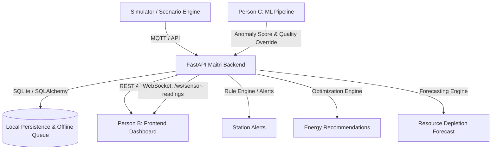

# Polarix Maitri Backend — Integration Contract & Demo Readiness Guide

This document defines the complete backend API surface, messaging protocols, scenario behaviors, and team handoff contracts for **Polarix SIH 2024**.

---

## 1. Team Responsibilities & Architecture Overview



- **Person A (Backend + Non-ML Python)**:
  - Core FastAPI backend, SQLite/SQLAlchemy ORM.
  - Telemetry validation, alert triggers, offline queueing, and recovery synchronization.
  - Resource inventory management, depletion forecasting, and deterministic energy optimization.
  - Python time-series telemetry simulator and SIH demo orchestration APIs.
- **Person B (Frontend Engineer)**:
  - React/Next.js/Vite dashboard consuming REST and WebSocket streams.
  - Station selector (`MTR` / `BHR`), live telemetry charts, resource depletion meters, alert center, and scenario control trigger cards.
- **Person C (ML / AI Engineer)**:
  - Anomaly detection and failure prediction models.
  - Attaches `anomaly_score` ($0.0$ to $1.0$) and assigns `quality` tags (`GOOD`, `WARNING`, `BAD`, `OFFLINE`) to incoming telemetry streams.

---

## 2. Complete REST API Reference

Base URL: `http://127.0.0.1:8000`

### 2.1. Stations & Sensors

#### `GET /stations`
- **Description**: Returns all configured Antarctic research stations.
- **Response `200 OK`**:
  ```json
  [
    {
      "id": 1,
      "name": "Maitri Station",
      "station_code": "MTR",
      "location": "Schirmacher Oasis, Queen Maud Land",
      "latitude": -70.7667,
      "longitude": 11.7333,
      "status": "ACTIVE",
      "created_at": "2026-09-18T20:00:00Z"
    },
    {
      "id": 2,
      "name": "Bharati Station",
      "station_code": "BHR",
      "location": "Larsemann Hills",
      "latitude": -69.4069,
      "longitude": 76.1908,
      "status": "ACTIVE",
      "created_at": "2026-09-18T20:00:00Z"
    }
  ]
  ```

#### `GET /stations/{station_id}`
- **Description**: Returns detailed information for a specific station (supports integer ID or station code like `MTR`).
- **Response `200 OK`**: Station object.
- **Response `404 Not Found`**: `{"detail": "Station 'XYZ' not found"}`.

#### `GET /stations/{station_id}/sensors`
- **Description**: Returns all sensors installed at the specified station across 4 core domains (`ENVIRONMENT`, `STRUCTURE`, `ENERGY`, `LOGISTICS`).
- **Response `200 OK`**:
  ```json
  [
    {
      "id": 1,
      "station_id": 1,
      "sensor_code": "MTR-ENV-TMP-01",
      "name": "Ambient Temperature Sensor",
      "domain": "ENVIRONMENT",
      "unit": "°C",
      "min_expected_value": -60.0,
      "max_expected_value": 20.0,
      "status": "ACTIVE",
      "created_at": "2026-09-18T20:00:00Z"
    }
  ]
  ```

---

### 2.2. Telemetry Ingestion & History

#### `POST /telemetry`
- **Description**: Ingest a single telemetry reading.
- **Request Body**:
  ```json
  {
    "station_code": "MTR",
    "sensor_code": "MTR-ENV-TMP-01",
    "value": -18.5,
    "unit": "°C",
    "quality": "GOOD",
    "source": "SIMULATOR",
    "anomaly_score": 0.05,
    "synced": true
  }
  ```
- **Response `201 Created`**:
  ```json
  {
    "id": 101,
    "station_id": 1,
    "sensor_id": 1,
    "timestamp": "2026-09-19T06:00:00Z",
    "value": -18.5,
    "unit": "°C",
    "quality": "GOOD",
    "source": "SIMULATOR",
    "anomaly_score": 0.05,
    "synced": true
  }
  ```
- **Validation Rules**:
  - Station existence verified (404 if invalid).
  - Sensor existence verified (404 if invalid).
  - Verifies sensor belongs to the station (400 if mismatched).
  - If `quality == "BAD"`, automatically creates a `HIGH` severity `SENSOR_FAULT` alert.
  - If `quality == "OFFLINE"`, automatically creates a `CRITICAL` severity `SENSOR_OFFLINE` alert.
  - If network is in `OFFLINE` mode, telemetry is automatically stored with `synced = False`.

#### `GET /stations/{station_id}/telemetry`
- **Query Params**: `limit` (default: 100, min: 1, max: 500).
- **Description**: Returns chronological telemetry history for the station, newest first.

#### `GET /stations/{station_id}/telemetry/latest`
- **Description**: Returns the single most recent telemetry record for every sensor installed at the station.
- **Response `200 OK`**: List of latest `TelemetryResponse` objects.

---

### 2.3. Operational Alerts

#### `GET /stations/{station_id}/alerts`
- **Query Params**:
  - `status`: Filter by status (`ACTIVE`, `ACKNOWLEDGED`, `RESOLVED`).
  - `limit`: (default: 100).
- **Response `200 OK`**:
  ```json
  [
    {
      "id": 1,
      "station_id": 1,
      "sensor_id": 4,
      "severity": "HIGH",
      "alert_type": "SENSOR_FAULT",
      "title": "Sensor Fault: MTR-ENG-GEN-01",
      "message": "Sensor 'MTR-ENG-GEN-01' at station 'MTR' reported BAD quality.",
      "anomaly_score": 0.95,
      "status": "ACTIVE",
      "created_at": "2026-09-19T06:10:00Z",
      "acknowledged_at": null,
      "resolved_at": null
    }
  ]
  ```

#### `POST /alerts/{alert_id}/ack`
- **Description**: Acknowledges an active alert.
- **Response `200 OK`**: Updated Alert object with `status = "ACKNOWLEDGED"` and `acknowledged_at` set.

#### `POST /alerts/{alert_id}/resolve`
- **Description**: Resolves an alert.
- **Response `200 OK`**: Updated Alert object with `status = "RESOLVED"` and `resolved_at` set.

#### `POST /alerts`
- **Description**: Manually create an operational alert.

---

### 2.4. Station Resources & Forecasting

#### `GET /stations/{station_id}/resources`
- **Description**: Returns inventory of resources at the station (Diesel, Battery, Water, Food, Medical, Spare Parts).
- **Response `200 OK`**:
  ```json
  [
    {
      "id": 1,
      "station_id": 1,
      "resource_type": "DIESEL",
      "current_quantity": 45000.0,
      "capacity": 60000.0,
      "consumption_rate": 350.0,
      "unit": "L",
      "status": "NORMAL",
      "created_at": "2026-09-18T20:00:00Z",
      "updated_at": "2026-09-18T20:00:00Z"
    }
  ]
  ```

#### `PATCH /resources/{resource_id}`
- **Description**: Update inventory level, status, or consumption rate.
- **Request Body**: `{"current_quantity": 42000.0, "status": "LOW", "consumption_rate": 360.0}`.

#### `GET /stations/{station_id}/resources/forecast`
- **Description**: Returns depletion time forecasts and risk level evaluations for all resources.
- **Response `200 OK`**:
  ```json
  [
    {
      "resource_id": 1,
      "station_id": 1,
      "resource_type": "DIESEL",
      "current_quantity": 45000.0,
      "capacity": 60000.0,
      "consumption_rate": 350.0,
      "unit": "L",
      "estimated_hours_remaining": 3085.71,
      "estimated_days_remaining": 128.57,
      "risk_level": "NORMAL",
      "forecast_message": "Resource 'DIESEL' operates at nominal reserve with 128.6 days remaining."
    }
  ]
  ```

Risk Levels:
- **`CRITICAL`**: Quantity = 0, or $\le 2$ days remaining, or reserve $\le 10\%$.
- **`WARNING`**: $\le 7$ days remaining, or reserve $\le 25\%$.
- **`LOW`**: $\le 14$ days remaining, or reserve $\le 40\%$.
- **`NORMAL`**: $> 14$ days remaining.

---

### 2.5. Energy Optimization

#### `GET /stations/{station_id}/energy/optimization`
- **Description**: Returns deterministic load balancing, battery reserve, solar prioritization, and emergency shed recommendations.
- **Response `200 OK`**:
  ```json
  {
    "station_id": 1,
    "current_energy_status": "OPTIMAL",
    "risk_level": "NORMAL",
    "recommended_mode": "STANDARD_BALANCED",
    "actions": [
      "Maintain standard dual-generator load-sharing profile",
      "Float charge battery storage banks at nominal maintenance voltage",
      "Maintain nominal baseline power distribution across all station sectors"
    ],
    "reason": "Energy reserves operating within nominal Antarctic parameters: Diesel reserve at 75.0% (128.6 days remaining), Battery storage at 85.0%.",
    "diesel_reserve_pct": 75.0,
    "battery_reserve_pct": 85.0,
    "solar_output_kw": 0.0,
    "estimated_diesel_days": 128.57
  }
  ```

Recommended Modes:
- **`STANDARD_BALANCED`**: Standard dual-generator load-sharing.
- **`SOLAR_PRIORITY`**: Solar generation active; throttles generator to standby, charges battery bank.
- **`FUEL_CONSERVATION`**: Sub-nominal diesel reserve; sheds secondary lab/HVAC heating loads.
- **`POWER_CRISIS_MINIMAL`**: Critical fuel/battery depletion; engages life-support-only power shedding.

---

### 2.6. Sync & Offline Network Control

#### `GET /sync/status`
- **Description**: Returns the network connection status and telemetry queue counters.
- **Response `200 OK`**:
  ```json
  {
    "network_status": "ONLINE",
    "is_online": true,
    "pending_count": 0,
    "synced_count": 120,
    "total_count": 120,
    "last_sync_timestamp": "2026-09-19T06:10:00Z",
    "message": "Network is ONLINE. All telemetry records synchronized."
  }
  ```

#### `POST /demo/network/offline`
- **Description**: Simulates satellite uplink failure. Subsequent telemetry ingests are stored with `synced = False`.

#### `POST /demo/network/online`
- **Description**: Simulates uplink recovery. Flushes the pending queue by updating all `synced = False` records to `synced = True`.

---

### 2.7. Commands API

#### `POST /commands`
- **Supported `command_type`**: `START_SCENARIO`, `STOP_SCENARIO`, `SET_NETWORK_OFFLINE`, `SET_NETWORK_ONLINE`, `REQUEST_SYNC`, `ACKNOWLEDGE_ALERT`, `RESOLVE_ALERT`.
- **Request Body**:
  ```json
  {
    "command_type": "START_SCENARIO",
    "station_code": "MTR",
    "payload": {
      "scenario": "STORM"
    }
  }
  ```
- **Response `201 Created`**: `CommandResponse` with `status: "PENDING"`.

#### `POST /commands/{command_id}/execute`
- **Description**: Executes the command, updates lifecycle status to `EXECUTED` (or `FAILED` on error), sets `executed_at`, and returns the executed command record.

#### `GET /commands` and `GET /commands/{command_id}`
- **Description**: Query command history and status.

---

### 2.8. Demo Orchestration API

#### `POST /demo/scenarios/{station_id}/{scenario_name}/start`
- **Path Params**: `station_id` (`MTR` or `BHR`), `scenario_name` (`NORMAL_DAY`, `STORM`, `POWER_CRISIS`, `SENSOR_FAILURE`, `SATELLITE_OUTAGE`, `RECOVERY`).
- **Query Params**: `step` (integer, default: 0).
- **Description**: Triggers a scenario, adjusts network mode if needed, generates & ingests telemetry, updates energy/resource state, and returns a unified dashboard response.
- **Response `200 OK`**:
  ```json
  {
    "station_id": 1,
    "station_code": "MTR",
    "scenario_name": "STORM",
    "status": "RUNNING",
    "is_active": true,
    "telemetry_generated_count": 5,
    "active_alerts_count": 2,
    "sync_status": {
      "network_status": "ONLINE",
      "is_online": true,
      "pending_count": 0,
      "synced_count": 50,
      "total_count": 50,
      "last_sync_timestamp": null,
      "message": "Network is ONLINE. All telemetry records synchronized."
    },
    "energy_optimization": { ... },
    "resource_forecast_summary": [ ... ],
    "message": "Scenario 'STORM' started successfully on station MTR."
  }
  ```

#### `POST /demo/scenarios/{station_id}/stop`
- **Description**: Stops active scenario simulation for the station.

#### `GET /demo/scenarios/{station_id}/status`
- **Description**: Returns active scenario name, start timestamp, sync mode, and active alert count.

#### `POST /demo/run/full-sequence/{station_id}`
- **Description**: Runs the complete 5-phase SIH judging sequence (`NORMAL_DAY` $\rightarrow$ `STORM` $\rightarrow$ `POWER_CRISIS` $\rightarrow$ `SATELLITE_OUTAGE` $\rightarrow$ `RECOVERY`) and returns results for each phase.

---

## 3. WebSocket Real-Time Stream Contract

### Connection URL
`ws://127.0.0.1:8000/ws/sensor-readings`

### Broadcast Protocol
Whenever sensor readings or telemetry are ingested, the backend broadcasts JSON events to all connected clients.

### Broadcast Event Shape:
```json
{
  "type": "TELEMETRY_UPDATE",
  "data": {
    "device_id": "MTR-ENV-TMP-01",
    "metric": "temperature",
    "value": -22.4,
    "unit": "°C",
    "timestamp": "2026-09-19T06:12:00Z"
  }
}
```

### Connection Handshake
Upon connecting, the client receives:
```json
{"status": "connected", "message": "Connected to sensor reading stream"}
```

---

## 4. MQTT Contract & Simulator Publishing

### Broker Settings
- **Host**: `MQTT_BROKER_HOST` (Default: `localhost`)
- **Port**: `MQTT_BROKER_PORT` (Default: `1883`)
- **Prefix**: `MQTT_TOPIC_PREFIX` (Default: `antarctic`)

### Topic Convention
- `antarctic/{station_id}/telemetry`
  - Examples: `antarctic/MTR/telemetry`, `antarctic/BHR/telemetry`

### MQTT Payload Schema
```json
{
  "station_code": "MTR",
  "sensor_code": "MTR-ENV-TMP-01",
  "value": -19.5,
  "unit": "°C",
  "quality": "GOOD",
  "source": "MQTT",
  "timestamp": "2026-09-19T06:15:00Z",
  "anomaly_score": 0.02,
  "synced": true
}
```

### Simulator Publishing Method
```python
from maitri.simulator import publish_simulated_telemetry

# Publishes generated batch to antarctic/MTR/telemetry
publish_simulated_telemetry("MTR", scenario="STORM", step=0, broker_host="localhost", broker_port=1883)
```

---

## 5. Deterministic Simulator Scenarios

| Scenario | Environmental Effects | Energy & Systems Effects | Anomaly & Sync Behavior |
| :--- | :--- | :--- | :--- |
| **`NORMAL_DAY`** | Diurnal sine oscillation around base ($-20$°C, $12$ m/s). | Nominal generator load ($180$ kW), nominal fuel ($75\%$). | `quality="GOOD"`, `anomaly_score=0.02`, `synced=True`. |
| **`STORM`** | Temperature drops by $22$°C, wind gusts $>45$ m/s, vibration $5\times$ base. | Solar generation collapses to near zero. | `quality="WARNING"`, `anomaly_score=0.85`, alerts triggered. |
| **`POWER_CRISIS`** | Nominal weather. | Generator output collapses by $>75\%$, battery drops, fuel warning. | `quality="BAD"`, `anomaly_score=0.92`, `HIGH` severity fault alert triggered. Energy mode switches to `FUEL_CONSERVATION` / `POWER_CRISIS_MINIMAL`. |
| **`SENSOR_FAILURE`** | Primary probe outputs $-999.0$. | Nominal power. | `quality="BAD"`, `anomaly_score=0.99`, triggers `SENSOR_FAULT` alert. |
| **`SATELLITE_OUTAGE`** | Normal operational telemetry generated. | Normal power. | `synced=False`, network sets to `OFFLINE`. Telemetry queued locally in SQLite database. |
| **`RECOVERY`** | Perturbations exponentially decay back to nominal base values ($e^{-0.2 \cdot \text{step}}$). | Systems normalize. | Network returns to `ONLINE`, queued telemetry synced and replayed. |

---

## 6. Frontend Handoff Guide (For Person B)

### Recommended Dashboard Component Mapping:
1. **Station Header & Network Indicator**:
   - Query `GET /sync/status` every $5$s.
   - Show green badge for `ONLINE`, amber for `SYNCING`, red blinking badge with pending count for `OFFLINE`.
   - Provide toggle buttons calling `POST /demo/network/offline` and `POST /demo/network/online`.
2. **Station Telemetry Cards / Real-time Gauges**:
   - Initial load: `GET /stations/{station_id}/telemetry/latest`.
   - Live update: Listen on WebSocket `ws://127.0.0.1:8000/ws/sensor-readings`.
3. **Resource Inventory & Depletion Meters**:
   - Query `GET /stations/{station_id}/resources/forecast`.
   - Render depletion progress bar with color-coded risk badge (`NORMAL` green, `LOW` blue, `WARNING` amber, `CRITICAL` red).
4. **Energy Optimization Card**:
   - Query `GET /stations/{station_id}/energy/optimization`.
   - Display `recommended_mode`, `diesel_reserve_pct`, and recommended `actions` checklist.
5. **Operational Alert Center**:
   - Query `GET /stations/{station_id}/alerts?status=ACTIVE`.
   - Provide **Acknowledge** (`POST /alerts/{id}/ack`) and **Resolve** (`POST /alerts/{id}/resolve`) action buttons.
6. **Scenario Control Panel (Judge Demo Buttons)**:
   - Provide 1-click scenario buttons calling `POST /demo/scenarios/{station_id}/{scenario_name}/start`.
   - Provide a prominent **"Run Full SIH Demo Flow"** button calling `POST /demo/run/full-sequence/{station_id}`.

---

## 7. Machine Learning Handoff Guide (For Person C)

### 7.1. Isolated ML Integration Adapter Slot
An isolated adapter layer is prepared in `maitri/services/ml_adapter.py`. 
Person C's ML API is **not connected yet**. When unconfigured or offline, the backend reports:
```
ML INTEGRATION: NOT CONNECTED
```
and produces **no fake anomaly scores** or placeholder predictions. Existing telemetry, energy optimization, logistics, and scenarios operate continuously without failure.

### 7.2. Configuration (Environment Variables)
Configure the external ML API without modifying code:
```env
ML_API_URL="http://your-ml-service-host:port"
ML_API_KEY="your-optional-bearer-or-api-key"
ML_API_TIMEOUT_SECONDS=2.0
```

### 7.3. Integration Slot Architecture & Endpoints
- **Status Endpoint**: `GET /ml/status` (reports current adapter connection state).
- **Contract Specification**: `GET /ml/contract` (shows placeholder request and response contracts).
- **Inference Test Slot**: `POST /ml/infer` (sends telemetry features to external ML API when connected).

### 7.4. How Person C Connects Their Model
When Person C provides the real ML service, integration requires only:
1. Setting `ML_API_URL` (and optional `ML_API_KEY`) in `.env`.
2. Updating `map_telemetry_to_request()` in `maitri/services/ml_adapter.py` to match Person C's request schema.
3. Updating `map_response_to_result()` in `maitri/services/ml_adapter.py` to parse Person C's response JSON.
4. Implementing genuine dispatch inside `dispatch_ml_result()` to trigger alerts or update twin states.

